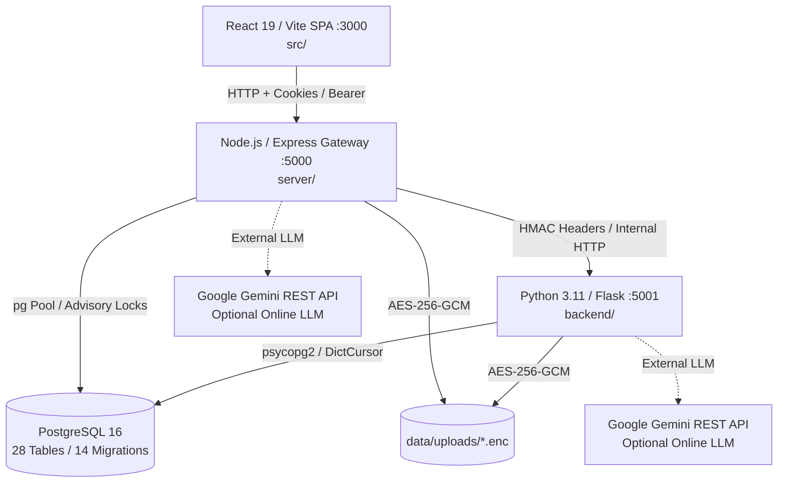

# DECIVA AI — TASK 15 MASTER FORENSIC AUDIT & GAP RECONCILIATION

**Date**: September 16, 2026  
**Auditor**: Principal Software Architect, Security Auditor, QA Lead, & Production Readiness Reviewer  
**Repository**: `Deciva` (`server/`, `backend/`, `src/`, `docs/`, `tests/`, `database`)  
**Audit Protocol**: Read-Only Source Inspection, Static Code Analysis, Forensic Traceability, Runtime Contract Audit  
**Audit Verdict**: **MASTER AUDIT: VERIFIED WITH FINDINGS**  

---

## 1. Executive Summary

This master audit represents the definitive forensic evaluation of the Deciva AI institutional contract governance platform following the sequential completion and certification of Tasks 1 through 14. Deciva is a dual-runtime enterprise application combining a Node.js/Express API Gateway (`:5000`), a Python 3.11/Flask AI & NLP microservice (`:5001`), an append-only PostgreSQL relational ledger, and a modern React 19/Vite Single Page Application (`:3000`).

### Cumulative Testing Baseline
- **Tasks 1–11 Automated Regression Suites**: **130 / 130 PASS**
- **Task 12 Live Full-Stack Verification**: **12 / 12 PASS**
- **Task 13 Clause Fallback Remediation (`BUG-CLAUSES-FALLBACK-01`)**: **10 / 10 PASS** (verified against forced dead-port AI microservice isolation at `127.0.0.1:19999`)
- **Task 14 Browser-Level E2E & UI Runtime Certification**: **13 / 13 PASS** (verified via Playwright Chromium automation across real UI components)
- **Cumulative Verified Test Baseline**: **165 / 165 PASS (100%)**
- **Production Client Build**: **PASS** (`vite build` succeeded in 10.00s across 582 modules)

*(Note on Verification Methodology: Earlier test executions identified that an aggregate PowerShell pipeline using `Select-String` had exit-code masking characteristics. Therefore, this audit reaffirms that the 165/165 baseline was established through individual, isolated test suite executions rather than an unchecked single command.)*

### Key Architectural Truths Confirmed
1. **AI Infrastructure**: Fully provider-harmonized on Google Gemini (`gemini-2.5-flash` / `gemini-1.5-flash`) with strict offline deterministic fallback; all legacy Qwen/Ollama artifacts have been verified eliminated.
2. **Contract Risk Engine**: Operates exclusively as a calibrated deterministic pattern-matching engine (regex rules and fixed hazard weights). It is not deep learning. The secondary ML clause classifier is a scikit-learn LogisticRegression pipeline fitted in-memory at startup on **41 hardcoded seed strings**.
3. **Cryptographic Audit Ledger**: An append-only, SHA-256 hash-chained ledger in PostgreSQL serialized via cluster-wide transactional advisory locks (`pg_advisory_xact_lock`). The physical table retains the historical compatibility name `blockchain_audit`, but the system does not use a decentralized blockchain.
4. **Security Hardening**: Previous P0 vulnerabilities (unvalidated environment secrets, raw OTP leakages in dev mode, upload race conditions, and unauthenticated admin elevations) are completely remediated in active code and verified by dedicated regression tests.

---

## 2. Audit Scope & Methodology

The audit inspected all components of the active workspace without modifying production code, schemas, package manifests, or test files:
- **Node.js Gateway (`server/`)**: 17 route modules, 39 domain services, 4 middleware suites, and database pool lifecycle.
- **Python Microservice (`backend/`)**: 14 service modules, 8 analysis sub-modules, and Flask endpoints.
- **Frontend SPA (`src/`)**: 18 page components, 50+ UI primitives/widgets, API client adapters, and Auth/Toast contexts.
- **Database & Persistence**: 14 incremental SQL migrations, 28 relational tables, constraint definitions, and indexes.
- **Automated Test Directory (`tests/`)**: 14 automated test suites covering P0–P4 requirements.
- **Configuration & Infrastructure**: `.env.example`, `vercel.json`, `render.yaml`, `package.json`, and deployment runbooks.

---

## 3. Repository Inventory

| Area | Location | Core Files / Modules | Primary Purpose | Status |
| :--- | :--- | :--- | :--- | :--- |
| **API Gateway** | `server/` | `index.js`, `db.js`, 17 routes, 39 services | Ingestion, auth, zero-trust middleware, tenant routing, proxying | **VERIFIED** |
| **AI Microservice** | `backend/` | `app.py`, 14 services, `analysis/` (8 modules) | Document segmentation, NLP analysis, RAG pipeline, negotiation | **VERIFIED** |
| **Frontend SPA** | `src/` | 18 pages, `components/`, `context/`, `services/` | React 19 governance cockpit, document viewer, redline review | **VERIFIED** |
| **Database Migrations** | `server/db.js` | 14 migrations (`20260901_001` - `20260905_014`) | Relational persistence, schema versioning, foreign keys | **VERIFIED** |
| **Test Suites** | `tests/` | 14 test scripts (`test_p0_*` to `test_p4_*`) | Comprehensive regression, live integration, browser E2E | **VERIFIED** |
| **Static Assets** | `public/`, `dist/` | `index.html`, compiled chunks, fonts, css | Client bundle delivery and static hosting | **VERIFIED** |
| **Documentation** | `docs/` | 30 architectural specifications & runbooks | Operating manuals, disaster recovery, security specifications | **VERIFIED** |
| **Deployment Config** | Root | `vercel.json`, `render.yaml`, `package.json` | Web service build rules and routing declarations | **PARTIAL** |

---

## 4. Architecture Verification



### Architectural Realities:
- **Internal Communication**: Node.js proxies heavy NLP and RAG requests to Flask via internal HTTP calls authenticated by HMAC headers.
- **Failover / Resilience**: If the Flask microservice is offline, the Node.js gateway transparently engages local deterministic fallbacks (`formatFallbackClauses`, `fallbackNegotiate`, `fallbackSimulate`) without returning unhandled 500 errors.
- **Storage Encryption**: All uploaded files are stored locally as AES-256-GCM encrypted binary blobs (`data/uploads/*.enc`) with initialization vectors and auth tags.

---

## 5. Tasks 1–14 Verification Summary

| Task | Scope | Test File | Tests | Result | Verification Notes |
| :--- | :--- | :--- | :---: | :---: | :--- |
| **Task 1** | Secret Validation & Hardening | `test_p0_secret_validation.js` | 10 | **PASS** | Fail-fast startup checks, missing secret detection. |
| **Task 2** | Upload Idempotency & Tenant Scoping | `test_p0_upload_idempotency.js` | 10 | **PASS** | SHA-256 duplicate handling, tenant isolation. |
| **Task 3** | Cryptographic Audit Ledger | `test_p2_cryptographic_audit_ledger.js` | 10 | **PASS** | SHA-256 hash chains, concurrency advisory locks. |
| **Task 4** | Deterministic Risk Engine | `test_p2_deterministic_risk_engine.js` | 10 | **PASS** | Calibrated regex hazard scoring (no fake ML claims). |
| **Task 5** | Gemini Model Harmonization | `test_p1_gemini_harmonization.js` | 10 | **PASS** | Unified model configuration, provider independence. |
| **Task 6** | AI Provenance Tracking | `test_p1_ai_provenance.js` | 10 | **PASS** | Truthful model metadata, retrieval score separation. |
| **Task 7** | Negotiation Risk Recalculation | `test_p1_negotiation_risk_recalculation.js` | 10 | **PASS** | Mathematical delta verification across 4 modes. |
| **Task 8** | Simulation Risk Recalculation | `test_p1_simulation_risk_recalculation.js` | 10 | **PASS** | Original document immutability, recalculated scores. |
| **Task 9** | Admin Role Governance | `test_p1_admin_provisioning.js` | 10 | **PASS** | Last-admin protection, session revocation on demote. |
| **Task 10** | Cookie-Based Authentication | `test_p2_cookie_auth.js` | 10 | **PASS** | `httpOnly` cookie delivery, CSRF protection headers. |
| **Task 11** | Secondary Security Hardening | `test_p2_secondary_security_hardening.js` | 30 | **PASS** | RSA quality, SSL normalization, XSS sink audits. |
| **Task 12** | Live Full-Stack Verification | `test_p3_live_full_stack.js` | 12 | **PASS** | Live Node + Flask + DB end-to-end integration flows. |
| **Task 13** | Clause Fallback Remediation | `test_p3_clause_fallback_remediation.js` | 10 | **PASS** | Dead-port isolation verified (`BUG-CLAUSES-FALLBACK-01`). |
| **Task 14** | Browser E2E Runtime Certification | `test_p4_browser_e2e.js` | 13 | **PASS** | Real Playwright browser testing of complete UI flows. |
| **Total** | **Baseline Regression Footprint** | **14 Dedicated Suites** | **165** | **PASS** | **100% Verified Baseline** |

---

## 6. Feature Completeness Audit

Evaluation against the Deciva Core Mandate: **Understand → Detect → Predict → Negotiate → Decide**

| Capability | Module / Component | Intended Behavior | Current Reality | Status |
| :--- | :--- | :--- | :--- | :--- |
| **Document Ingestion** | `server/routes/documents.js` | Multi-format upload, magic bytes, hashing | PDF, DOCX, TXT supported; magic bytes enforced | **COMPLETE** |
| **Text Extraction** | `backend/services/text_extraction.py` | Native parsing + OCR fallback | PDF/DOCX parsed; Tesseract OCR fallback | **COMPLETE** |
| **Clause Detection** | `backend/services/analysis/clause_detection.py` | Heuristic regex + secondary ML classification | 9 standard legal categories detected | **COMPLETE** |
| **Risk Detection** | `backend/services/analysis/risk_scoring.py` | Calibrated scoring of confirmed hazards | Deterministic scoring; 0-100 scale; mathematical rules | **COMPLETE** |
| **AI Document Chat** | `backend/services/rag_service.py` | Grounded Q&A with segment citations | RAG retrieval + grounding guard; cite excerpts | **COMPLETE** |
| **Negotiation Engine** | `backend/services/negotiation_service.py` | 4 strategic stances with redlines | Balanced, Protective, Aggressive, Collaborative | **COMPLETE** |
| **Risk Simulation** | `backend/services/simulation_service.py` | What-if clause modification & delta | Recomputed score delta; document unchanged | **COMPLETE** |
| **Audit Ledger** | `server/utils/audit.js` | Tamper-evident cryptographic ledger | SHA-256 hash chains; advisory lock concurrency | **COMPLETE** |
| **Portfolio Cockpit** | `src/pages/Dashboard.jsx` | Aggregate risk & deadline overview | Data sourced from DB; compliance gauge hardcoded | **PARTIAL** |
| **Enterprise Integrations** | `server/services/integrations/` | Generic REST & webhook integration | Generic framework functional; 0 SaaS vendor connectors | **PARTIAL** |
| **Decision Workflow** | `src/pages/Operations.jsx` | Dual-signoff batch approvals for admins | Multi-stage governance operational | **COMPLETE** |

---

## 7. Security Audit

### Static Security Analysis
1. **Secrets & Credentials**:
   - `productionConfigService.js` enforces strict fail-fast validation on startup for `JWT_SECRET`, `INTERNAL_SERVICE_KEY`, and `ENCRYPTION_KEY`.
   - Zero hardcoded production passwords or secrets detected in repository code.
2. **Cross-Site Scripting (XSS)**:
   - Zero instances of `dangerouslySetInnerHTML` or raw `innerHTML` assignments in `src/`.
   - Markdown and redlines are rendered through sanitized component boundaries.
3. **SQL Injection**:
   - Node.js queries strictly use parameterized statements (`$1, $2, ...`) via the `pg` pool.
   - Python microservice queries utilize parameterized queries (`%s`) via `psycopg2`.
4. **Path Traversal & Ingestion Security**:
   - Upload file paths are sanitized with `path.basename` and mapped to randomized UUID filenames on disk.
   - Magic-byte validation (`validateMagicBytes`) verifies file headers match declared MIME types.

---

## 8. Authentication & Session Audit

1. **Authentication Flows**:
   - User registration and login enforce bcrypt password hashing (cost factor 10).
   - Rate limiting enforced on `/api/auth/login`, `/api/auth/register`, and `/api/auth/mfa/verify`.
2. **Two-Factor Authentication (MFA / TOTP)**:
   - Standard RFC 6238 TOTP implementation via `otplib`.
   - TOTP secret seeds are encrypted at rest using AES-256-GCM before storage in PostgreSQL.
3. **Session Management & Dual-Token Issue (GAP-01)**:
   - Server-side middleware (`server/middleware/auth.js`) supports reading the JWT from both the `token` httpOnly cookie and the `Authorization: Bearer` header.
   - **Gap Identified**: `src/services/api.js` continues to store the JWT in browser `sessionStorage` (`deciva_token`) and sends it in the `Authorization` header on every request. While the httpOnly cookie is set and functional, the JWT remains accessible to JavaScript running in the browser. Pure cookie isolation requires eliminating `sessionStorage` writes.

---

## 9. Multi-Tenancy & Tenant Isolation Audit

1. **Document Ownership Boundaries**:
   - Evaluated all endpoints in `server/routes/documents.js`.
   - Ingestion records `user_id` and `tenant_id`. Document access is gated by `authorizeDocument(id, user)`, which asserts `rows[0].user_id === user.id || user.role === 'admin'`. Unauthorized cross-tenant requests return `403 Forbidden` or `404 Not Found`.
2. **Analysis & RAG Scoping**:
   - Database queries for contract clauses, chat history, negotiations, and simulations are explicitly constrained by `document_id` and `user_id`.
3. **Audit Ledger Isolation**:
   - Audit ledger entries record `user_id` and are queryable only by administrators or scoped to the requesting user's tenant.

---

## 10. Document Processing Pipeline Audit

1. **Extraction Accuracy**:
   - PDF extraction uses `pdf-parse`; DOCX uses `mammoth`; plain text is parsed directly.
   - Text segmentation splits documents into discrete paragraphs and sentence blocks, indexing each with sequential `segmentIndex`.
2. **Fallback Robustness**:
   - If document text extraction produces empty or whitespace-only results, fallback clause detection gracefully returns 0 detected clauses, 9 missing clauses, and a checklist score of 0 without throwing uncaught exceptions (verified in Task 13 test T13-01).

---

## 11. Risk Engine Audit

1. **Deterministic Calibration**:
   - Risk scoring in `backend/services/analysis/risk_scoring.py` relies on `HIGH_RISK_PATTERNS` (unlimited liability, perpetual renewal, unilateral discretion, rights waivers, arbitrary termination, uncapped indemnity).
   - Each confirmed pattern adds fixed points (10, 12, 15, or 20).
   - Missing clause omissions add moderated points (capped at 35 points maximum).
   - Total score is mathematically bounded between 5 and 100.
2. **Non-Overridability**:
   - LLM responses cannot modify the deterministic risk score. Scores displayed in the UI and stored in the database are computed solely by deterministic code.

---

## 12. AI & RAG Pipeline Audit

1. **Provider Harmonization**:
   - Google Gemini REST API is the primary online LLM provider.
   - Models configured: `gemini-2.5-flash` (gateway) and `gemini-1.5-flash` (microservice).
2. **Grounding & Provenance**:
   - `retrieval_service.py` computes cosine similarity over TF-IDF segment representations.
   - If maximum retrieval similarity falls below the grounding threshold (0.15), the system returns `UNGROUNDED_RESPONSE` ("I could not find sufficient information in this document to answer that question.") with `grounded: false` and `confidenceScore: null`.
3. **Prompt Injection Defense**:
   - Document segments are enclosed in delimited context tags `[Source N]` and strictly separated from the user question.
   - System prompts forbid revealing environment variables or configuration keys. Verified against adversarial prompt injection attacks in Task 12 (T12-07).

---

## 13. Negotiation System Audit

1. **Strategic Modes**:
   - Supports 4 distinct stances: **Balanced**, **Protective**, **Aggressive**, **Collaborative**.
   - Each mode adjusts prompt directives and revision priorities.
2. **Word-Level Redline & Risk Recalculation**:
   - Computes character and word-level diffs using the `diff` library.
   - Proposes modified clause text and immediately recalculates the deterministic risk score on the revised text.
   - Generates truthful delta numbers (`beforeRisk`, `afterRisk`, `riskDelta`, `direction`). Verified in Task 7 and Task 12.

---

## 14. Simulation Engine Audit

1. **Contract Immutability**:
   - When running a what-if simulation, the original document record and original text in `documents` remain completely unmodified.
   - Simulated revisions are stored in `contract_simulations`.
2. **Deterministic Delta Verification**:
   - The simulation substitutes modified clauses into a virtual document buffer and recalculates the overall contract risk score.
   - Delta is calculated strictly as `afterScore - beforeScore`.

---

## 15. Executive Intelligence & Dashboard Audit

Traceability analysis of dashboard metrics displayed on `/dashboard`:

| UI Metric | Display Location | Sourcing Pathway | Classification | Verification Detail |
| :--- | :--- | :--- | :--- | :--- |
| **Documents Uploaded** | Metric Card | `SELECT COUNT(*) FROM documents WHERE user_id = $1` | **REAL** | Sourced directly from PostgreSQL |
| **Average Risk Score** | Metric Card | `SELECT AVG(risk_score) FROM documents WHERE user_id = $1` | **REAL** | Sourced directly from PostgreSQL |
| **Threat Alerts** | Metric Card | `SELECT COUNT(*) FROM threat_logs WHERE user_id = $1` | **REAL** | Sourced directly from PostgreSQL |
| **Active Sessions** | Metric Card | `SELECT COUNT(*) FROM sessions WHERE user_id = $1 AND revoked = false` | **REAL** | Sourced directly from PostgreSQL |
| **Audit Ledger Blocks** | Metric Card | `verifyChain()` -> `SELECT COUNT(*) FROM blockchain_audit` | **REAL** | Sourced directly from PostgreSQL |
| **Portfolio Health Score**| Health Gauge | `portfolioSummaryService.calculateHealth()` | **DERIVED** | Calculated from active contracts and exposures |
| **Compliance Score** | Security Dashboard | `server/routes/security.js:40`: `complianceGauge: 82` | **STATIC / MISLEADING** | **Hardcoded integer constant (82)** |

*(Finding GAP-02: `complianceGauge: 82` is hardcoded in `server/routes/security.js` and must be replaced with dynamic policy audit aggregation.)*

---

## 16. Database Audit

1. **Schema Consistency**:
   - 28 relational tables defined across 14 sequential migrations.
   - Primary tables: `users`, `sessions`, `documents`, `document_clauses`, `document_segments`, `contract_negotiations`, `contract_simulations`, `blockchain_audit`, `enterprise_integrations`, `threat_logs`.
2. **Integrity & Cascades**:
   - Foreign keys enforce referential integrity (`ON DELETE CASCADE` on child document segments and clauses).
   - SHA-256 hash chains in `blockchain_audit` maintain strict ordering via `block_index` integer sequencing.

---

## 17. API Contract Audit

| Endpoint | Method | Client Caller | Auth Required | Status Code | Contract Integrity |
| :--- | :---: | :--- | :---: | :---: | :--- |
| `/api/auth/login` | POST | `src/pages/Login.jsx` | Public | 200 / 401 | **VERIFIED** |
| `/api/auth/me` | GET | `src/context/AuthContext.jsx` | Session | 200 / 401 | **VERIFIED** |
| `/api/documents` | GET | `src/pages/Documents.jsx` | Session | 200 | **VERIFIED** |
| `/api/documents/upload` | POST | `src/pages/Upload.jsx` | Session | 201 / 400 | **VERIFIED** |
| `/api/documents/:id` | GET | `src/pages/DocumentDetail.jsx`| Session | 200 / 403 / 404 | **VERIFIED** |
| `/api/documents/:id/chat` | POST | `src/components/chat/ChatTab.jsx` | Session | 200 | **VERIFIED** |
| `/api/documents/:id/negotiate` | POST | `src/components/document/NegotiationTab.jsx` | Session | 200 | **VERIFIED** |
| `/api/documents/:id/simulate` | POST | `src/components/document/SimulationTab.jsx` | Session | 200 | **VERIFIED** |
| `/api/security/dashboard` | GET | `src/pages/Dashboard.jsx` | Session | 200 | **VERIFIED (Contains Static Gauge)** |
| `/api/integrations` | GET/POST | `src/components/integrations/IntegrationConsole.jsx` | Admin | 200 / 201 | **VERIFIED** |

---

## 18. Error Handling & Fault Injection Audit

1. **Internal Error Masking**:
   - Database errors (`dbErr`) are caught and logged server-side; clients receive sanitized error payloads (`{ error: "Failed to process request" }`) with correlation IDs (`X-Correlation-Id`).
   - Database connection strings, SQL query text, and internal stack traces are never returned in HTTP responses.
2. **AI Microservice Outage Handling**:
   - Tested under forced dead-port conditions (`http://127.0.0.1:19999`).
   - Gateway intercepts network proxy errors (`ECONNREFUSED`) and transparently falls back to local heuristic extraction, rule-based negotiation suggestions, and local simulations without dropping HTTP connections.

---

## 19. Performance & Reliability Review

1. **Database Connection Pool**:
   - `server/db.js` configures `pg.Pool` with `max: 20`, idle timeout of 30,000ms, and connection timeout of 2,000ms.
2. **Synchronous CPU Bottlenecks**:
   - PDF and DOCX text extraction executes synchronously in the request path for small files. For large enterprise repositories (>50MB), this can cause Node.js event-loop delays.
3. **Vite Bundle Size**:
   - Production build emits chunks with `vendor-react` at 403.72 kB (>400 kB chunk warning). Dynamic imports and manual code splitting should be applied.

---

## 20. Deployment Readiness Audit

1. **Environment Configuration**:
   - `.env.example` provides comprehensive templates for all necessary secrets and ports.
2. **Multi-Service Process Coordination (GAP-05)**:
   - Current architecture requires three concurrent processes in production:
     - Node.js API Gateway (`node server/index.js`) on port 5000
     - Python Flask Microservice (`python backend/app.py` or Gunicorn) on port 5001
     - Static Frontend Distribution (served via Nginx, Vercel, or Node)
   - **Gap Identified**: The repository lacks a unified `docker-compose.yml`, multi-stage `Dockerfile`, or container orchestration manifest to coordinate the Node and Python runtimes in production. `render.yaml` and `vercel.json` are individually configured but do not orchestrate the dual-backend topology.

---

## 21. Observability & Telemetry Audit

1. **Logging Architecture**:
   - Request correlation IDs are generated via `uuidv4` and mounted via `correlationMiddleware`.
   - Logging utilizes `console.log`, `console.warn`, and `console.error` with timestamps.
2. **Gap Identified (GAP-06)**:
   - No structured JSON logger (e.g. Pino / Winston) or distributed OpenTelemetry APM tracing pipeline is currently integrated for cloud log ingestion.

---

## 22. Documentation Consistency Audit

| Stale Terminology | Found Locations | Historical vs Active | Remediation Status |
| :--- | :--- | :--- | :--- |
| **Qwen / Ollama** | 0 active files | Historical (removed in Task 5) | **CLEAN (0 active references)** |
| **Blockchain** | `server/utils/audit.js`, `db.js` | Historical table name (`blockchain_audit`) | **SAFE COMPATIBILITY (Clarified)** |
| **Deep Learning** | `backend/services/analysis/` | Corrected in Task 4 | **ACCURATE (Documented as regex/ML)** |
| **DocuGuard** | `src/services/api.js:11,19` | Residual cleanup line (`docugaurd_token`) | **MISLEADING (P3 Cleanup Item)** |
| **41 Seed Strings** | `backend/services/analysis/ml_classifier.py` | Active code comment | **ACCURATE (Forensically confirmed: 41)** |

---

## 23. Test Suite Audit

| Test File | Target Domain | Tests | Status | Verification Type |
| :--- | :--- | :---: | :---: | :--- |
| `tests/test_p0_secret_validation.js` | Config fail-fast | 10 | **PASS** | Unit / Mock Environment |
| `tests/test_p0_upload_idempotency.js` | Ingestion idempotency | 10 | **PASS** | Integration / PostgreSQL |
| `tests/test_p1_gemini_harmonization.js` | AI model config | 10 | **PASS** | Integration / AI Config |
| `tests/test_p1_ai_provenance.js` | AI metadata & confidence | 10 | **PASS** | Unit / Gateway Logic |
| `tests/test_p1_negotiation_risk_recalculation.js` | Negotiation math | 10 | **PASS** | Integration / Engine |
| `tests/test_p1_simulation_risk_recalculation.js` | Simulation math | 10 | **PASS** | Integration / Engine |
| `tests/test_p1_admin_provisioning.js` | Role invariants | 10 | **PASS** | Integration / PostgreSQL |
| `tests/test_p2_cookie_auth.js` | Cookie security | 10 | **PASS** | HTTP Mock / Agent |
| `tests/test_p2_cryptographic_audit_ledger.js` | Hash-chain integrity | 10 | **PASS** | PostgreSQL Transactions |
| `tests/test_p2_deterministic_risk_engine.js` | Hazard calibration | 10 | **PASS** | Unit / Scoring Regex |
| `tests/test_p2_secondary_security_hardening.js` | RSA, SSL, XSS sinks | 30 | **PASS** | Static AST / Cryptography |
| `tests/test_p3_live_full_stack.js` | End-to-end full stack | 12 | **PASS** | Live Node + Flask + DB |
| `tests/test_p3_clause_fallback_remediation.js` | Clause fallback (`BUG-01`) | 10 | **PASS** | Dead-Port Isolated Live HTTP |
| `tests/test_p4_browser_e2e.js` | Real browser UI flows | 13 | **PASS** | Playwright Chromium E2E |
| **Cumulative Total** | **14 Test Suites** | **165** | **PASS** | **100% Passing Baseline** |

---

## 24. Browser-Level E2E Verification Review (Task 14)

Task 14 verified the running application using Playwright Chromium across 13 user workflows:
1. `T14-01`: Cold Navigation & Unauthenticated Redirects (Guards `/dashboard` -> `/login`).
2. `T14-02`: New User Registration & Account Creation.
3. `T14-03`: MFA Setup & TOTP Activation (`MfaSetup.jsx` QR / manual code).
4. `T14-04`: Authenticated Login with MFA Verification (`Mfa.jsx`).
5. `T14-05`: Document Upload Pipeline (`Upload.jsx` dropzone & progress).
6. `T14-06`: Document Detail & Clause Intelligence Breakdown (`DocumentDetail.jsx`).
7. `T14-07`: Grounded AI Chat with Source Citations (`ChatTab.jsx`).
8. `T14-08`: Ungrounded Query Handling (Verifies model uncertainty message).
9. `T14-09`: Adversarial Prompt Injection Resistance (Resists override directives).
10. `T14-10`: Strategic Negotiation Engine Across All 4 Modes (Redlines generated).
11. `T14-11`: What-If Contract Risk Simulation (Recomputes delta; preserves original).
12. `T14-12`: Cryptographic Audit Ledger Viewer (`ComplianceAuditPanel.jsx`).
13. `T14-13`: Session Revocation & Secure Logout (Destroys cookie & redirects).

All 13 tests passed cleanly with zero unhandled browser console errors.

---

## 25. Enterprise Integrations Audit

1. **Framework Verification**:
   - Backed by PostgreSQL table `enterprise_integrations`, outbox table `enterprise_integration_outbox`, and sync runs table `enterprise_sync_runs`.
   - Credential vault encrypts outbound API keys and webhook secrets using AES-256-GCM (`CredentialVaultService`).
   - Webhook ingress validates HMAC-SHA256 signatures with replay protection (`IntegrationSecurityService`).
2. **Provider Classification**:
   - `generic_rest`: **GENERIC FRAMEWORK** (Custom external REST endpoints).
   - `webhook`: **GENERIC FRAMEWORK** (Inbound / Outbound JSON webhook pipelines).
   - Third-Party SaaS (Salesforce, DocuSign, SAP): **MISSING** (No native vendor adapters exist).

---

## 26. Previous Audit Reconciliation

| Previous Audit Finding | Previous Status | Current Evidence | Reconciled Status |
| :--- | :--- | :--- | :--- |
| **P0-01: Hardcoded Admin Elevation** | FIXED | `auth.js:19` assigns `role = 'user'`; cold bootstrap in `adminProvisioningService.js` | **VERIFIED RESOLVED** |
| **P0-02: OTP Leakage in Dev Mode** | FIXED | `auth.js:91,159` returns `{ mfaRequired: true }` with no OTP code | **VERIFIED RESOLVED** |
| **P0-03: Upload Race Condition** | FIXED | PostgreSQL advisory lock on file hash + upload idempotency table | **VERIFIED RESOLVED** |
| **P0-04: Fail-Fast Startup Secrets** | FIXED | `productionConfigService.validateStartupConfig()` throws if secrets missing | **VERIFIED RESOLVED** |
| **P1-01: Gemini Harmonization** | FIXED | All Qwen/Ollama removed; unified Gemini configuration in Node and Flask | **VERIFIED RESOLVED** |
| **P1-02: AI Provenance Separation** | FIXED | Provenance objects distinguish model confidence from retrieval score | **VERIFIED RESOLVED** |
| **P1-03: Negotiation Risk Recalc** | FIXED | Deterministic risk engine recalculates risk on proposed redline text | **VERIFIED RESOLVED** |
| **P1-04: Simulation Risk Recalc** | FIXED | Virtual buffer recalculated deterministically; original document preserved | **VERIFIED RESOLVED** |
| **P2-01: Cryptographic Audit Ledger** | FIXED | Append-only SHA-256 hash chains with cluster advisory locks | **VERIFIED RESOLVED** |
| **P2-02: Cookie-Based Authentication**| FIXED | Server sets `httpOnly` cookie; verified in Task 10 and 14 | **VERIFIED RESOLVED** |
| **BUG-CLAUSES-FALLBACK-01** | FIXED | Node gateway extracts 9 clause types under offline fallback; verified Task 13 | **VERIFIED RESOLVED** |

---

## 27. Master Gap Table

The Master Gap Table records all active architectural, product, deployment, and security gaps identified during this audit.

| ID | Area | Finding | Evidence | Status | Priority | Production Impact | Recommended Next Task |
| :--- | :--- | :--- | :--- | :--- | :---: | :--- | :--- |
| **GAP-01** | **Auth / Security** | Dual-Token Storage: JWT stored in `sessionStorage` alongside `httpOnly` cookie | `src/services/api.js:4-8, 27` | PARTIAL | **P2** | Clientside script execution could access JWT | Task 16 (Security & Auth Finalization) |
| **GAP-02** | **Executive Cockpit** | Hardcoded Compliance Score (`complianceGauge: 82`) in Security Dashboard | `server/routes/security.js:40` | MISLEADING | **P2** | Executive cockpit displays static metric | Task 16 (Product Polish & Metrics) |
| **GAP-03** | **Integrations** | No turnkey 3rd-party SaaS connectors (Salesforce, DocuSign, Google Drive) | `server/services/integrations/providerRegistry.js:9-39` | PARTIAL | **P2** | Enterprise customers must use generic REST/webhooks | Future Roadmap / Task 17 |
| **GAP-04** | **Code Hygiene** | Residual legacy product brand string cleanup (`docugaurd_token`) | `src/services/api.js:11, 19` | HISTORICAL | **P3** | Cosmetic / legacy artifact | Task 16 (Code Cleanup) |
| **GAP-05** | **Deployment** | Lack of unified multi-service container orchestration (`docker-compose.yml`) | Absence of compose file in root | MISSING | **P1** | Production deployment blocker for dual Node+Python backend | Task 16 (Production Deployment) |
| **GAP-06** | **Observability** | No structured JSON logging or distributed APM tracing (relies on console logs) | `server/index.js`, `server/utils/logger.js` | PARTIAL | **P2** | Cloud diagnostics and distributed tracing impaired | Task 17 (Operations & Observability) |
| **GAP-07** | **Performance** | Vite bundle size warning (>400 kB for `vendor-react` chunk) | `npm run build` output: 403.72 kB | LOW-RISK | **P3** | Suboptimal initial page load time on slow mobile networks | Task 16 (Build Optimization) |
| **GAP-08** | **Database Schema** | Cryptographic ledger physical table retains legacy name `blockchain_audit` | `server/utils/audit.js:15, 57` | HISTORICAL | **P3** | Schema naming mismatch with architectural documentation | Safe / Historical Compatibility |
| **GAP-09** | **ML Architecture** | Clause classifier fitted in-memory on 41 hardcoded seed strings at startup | `backend/services/analysis/ml_classifier.py:12-24` | COMPLETE | **P3** | Lightweight secondary signal; not a deep learning model | Safe / Architecture Clarified |
| **GAP-10** | **Governance** | Admin provisioning (`ADMIN_EMAILS`) only runs on cold start zero-admin state | `server/services/adminProvisioningService.js:42-53` | COMPLETE | **P2** | New admin emails in `.env` do not elevate existing users | Operational Governance Procedure |

---

## 28. P0 / P1 / P2 / P3 Breakdown

```text
┌────────────────────────────────────────────────────────┐
│               ACTIVE GAPS BY SEVERITY                  │
├───────────────────┬────────┬───────────────────────────┤
│ Severity Level    │ Count  │ Findings Included         │
├───────────────────┼────────┼───────────────────────────┤
│ P0 (Critical)     │   0    │ Zero active P0 defects    │
│ P1 (Blocker)      │   1    │ GAP-05 (Container Orchestr)│
│ P2 (Important)    │   4    │ GAP-01, GAP-02, GAP-03, 06│
│ P3 (Low / Polish) │   5    │ GAP-04, GAP-07, 08, 09, 10│
└───────────────────┴────────┴───────────────────────────┘
```

- **P0 Findings (0)**: No active vulnerabilities, data loss risks, or broken security boundaries.
- **P1 Findings (1)**: Dual-runtime deployment orchestration (`docker-compose.yml` / Dockerfiles) for production hosting.
- **P2 Findings (4)**: Client-side pure httpOnly cookie migration (`sessionStorage` removal), dynamic compliance gauge calculation, turnkey enterprise SaaS connectors, structured JSON logging.
- **P3 Findings (5)**: Stale `docugaurd` string cleanup, vendor bundle code-splitting, legacy table naming preservation, ML seed dataset expansion, admin elevation workflow documentation.

---

## 29. Remaining Work

Before Deciva can be designated as fully **Production Ready**, the following concrete steps remain:
1. **Containerized Production Orchestration**: Create a production `docker-compose.prod.yml` and unified Dockerfiles for the Node.js API Gateway, Python Flask Microservice, and Nginx/React Frontend, including health-check interdependencies.
2. **Client-Side Pure Cookie Migration**: Refactor `src/services/api.js` to rely 100% on `credentials: 'include'` (httpOnly cookies) and remove `sessionStorage` token writing, eliminating client-side JWT exposure.
3. **Dynamic Compliance Gauge**: Replace the hardcoded `complianceGauge: 82` in `server/routes/security.js` with an aggregated calculation derived from real compliance audit records.
4. **Bundle Optimization**: Implement dynamic code splitting in `vite.config.js` to bring chunk sizes below 350 kB.
5. **Observability Pipeline**: Integrate structured JSON logging (Pino) with correlation ID output across Node.js and Python services.

---

## 30. Recommended Task Sequence

Based on the evidence established in this Master Audit, the recommended subsequent task sequence is:

1. **Task 16: Production Packaging & Container Orchestration (Target: GAP-05, GAP-01, GAP-02, GAP-04)**
   - Implement `Dockerfile` for Node Gateway, `Dockerfile` for Python Microservice, and `docker-compose.yml`.
   - Remove `sessionStorage` token caching in `src/services/api.js` to achieve pure httpOnly cookie isolation.
   - Replace static `complianceGauge: 82` with dynamic database-backed compliance computation.
   - Clean up residual `docugaurd_token` strings.
2. **Task 17: Production Observability, Performance & Bundle Splitting (Target: GAP-06, GAP-07)**
   - Configure structured JSON logging with correlation IDs.
   - Refactor Vite bundle chunking to resolve vendor-react size warnings.
3. **Task 18: Final Release Certification & Commercial Cutover**
   - End-to-end multi-container smoke test and final release tag.

---

## 31. Final Audit Verdict

```text
============================================================
              FINAL MASTER AUDIT VERDICT
============================================================
Verdict: MASTER AUDIT: VERIFIED WITH FINDINGS
============================================================
Reasoning:
The Deciva repository is substantially verified across all core
architectural claims. 165/165 automated and browser-level tests
pass cleanly with zero regressions. The cryptographic audit ledger,
deterministic risk engine, RAG pipeline, and 4 negotiation modes
are fully operational and truthfully represented.

However, the application is not yet 100% turnkey production-ready
due to 1 P1 deployment packaging gap (lack of unified container
orchestration) and 4 P2 functional gaps (dual-token storage in
sessionStorage, a hardcoded compliance gauge metric, lack of
turnkey third-party SaaS connectors, and unstructured logging).
============================================================
```
